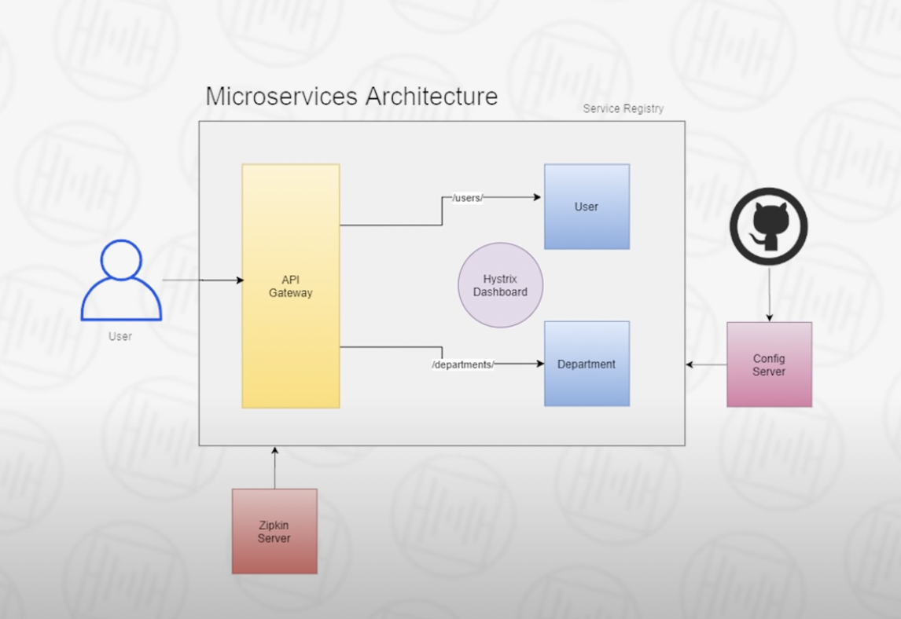

# Springboot Microservices
## _Implementing microservices using Spring Boot_

This is a demo application of microservices architecture using Spring Boot.
There are two services here that exist for this usecase:
- Department Service
- User Service

Department contain the information about a department while User contains information about a user. User can have one department. So, User Service will communicate with Department service to receive the Department information for the user.

Now whole of the microservcie ecosystem contains many more components as shown in this image:



These compoents are:

# 1. Service Registry
This is a Spring Boot service that will contain the infromation of all the running microservices. It is implemented using Eureka Server.
`SpringBootApplication` is required to be marked with `@EnableEurekaServer`
### POM Dependencies
- spring-cloud-starter-netflix-eureka-server
### application.yml
```
server.port=8761
eureka.client.register-with-eureka=false
eureka.client.fetch-registry=false
```

# 2. API Gateway
This is a window into our microservices usecase. This component acts as a common entry point to call the microservices.
- `SpringBootApplication` is required to be marked with `@EnableEurekaClient` so that it is recognised by Service Registry
- We have also implemented Hystrix for fallback circuit breaker. Basically whenever a service will be down, a fallback mechanism will be triggered which will route the request to the FallbackController in this API Gateway. We can then provide the configuration to route the microservices to this fallback controller. ( ref. spring.cloud.gateway.routes* in application.yml)
- To enable Hystrix we need to annotate `SpringBootApplication` with `@EnableEurekaClient`.
- In the `application.yml` configuration below we also have to config `hystric.stream` so that it will be shared with the `hystric.dasboard`.
### POM Dependencies
- spring-boot-starter-actuator
- spring-cloud-starter-gateway
- spring-cloud-starter-netflix-eureka-client
- spring-cloud-starter-netflix-hystrix
- spring-cloud-starter-config
### application.yml
```
server:
  port: 9191

spring:
  application:
    name: API-GETWAY
  cloud:
    gateway:
      routes:
        - id: USER-SERVICE
          uri: lb://USER-SERVICE
          predicates:
            - Path=/users/**
          filters:
            - name: CircuitBreaker
              args:
                name: USER-SEVICE
                fallbackuri: forward:/userServiceFallback
        - id: DEPARTMENT-SERVICE
          uri: lb://DEPARTMENT-SERVICE
          predicates:
            - Path=/departments/**
          filters:
            - name: CircuitBreaker
              args:
                name: DEPARTMENT-SEVICE
                fallbackuri: forward:/departmentServiceFallback

hystrix:
  command:
    fallbackcmd:
      execution:
        isolation:
          thread:
            timeoutInMilliseconds: 4000

management:
  endpoints:
    web:
      exposure:
        include: hystrix.stream
```

# 3. Hystrix Dashboard
The Hystrix Dashboard allows you to monitor Hystrix metrics in real time.
- We need to add `@EnableEurekaClient` annotation in the `SpringBootApploication`.
- Also `@EnableHystricDashboard` is also required in the `SpringBootApplication`.
### POM Dependencies
- spring-cloud-starter-netflix-eureka-client
- spring-cloud-starter-netflix-hystrix-dashboard
- spring-cloud-starter-config

### application.yml
```
server:
  port: 9295


spring:
  application:
    name: HYSTRIX-DASHBOARD

hystrix:
  dashboard:
    proxy-stream-allow-list: "*"
```

# 4. Config Server
We need to abstract the important configuration out of this architecture and place it at some centralized location like github. In production, there might be hundreds of microservices running. So if we need to update a single common configuration, then all of the microservices will be required to be updated. This can be prevented by keeping a centralised (Cloud) Config Server.
### POM Dependencies
- spring-cloud-config-server
- spring-cloud-starter-netflix-eureka-client
### application.yml
```
server:
  port: 9296

spring:
  application:
    name: CONFIG-SERVER
  cloud:
    config:
      server:
        git:
          uri: https://github.com/ravi2519/config-server
          clone-on-start: true
```

### bootstrap.yml ( common configuration required to be placed in all the eureka clients )
```
spring:
  cloud:
    config:
      enabled: true
      uri: http://localhost:9296
```
This is to get the config server. It needs to be placed in `bootstrap.yml` so that it can be invoked before creating application context.
